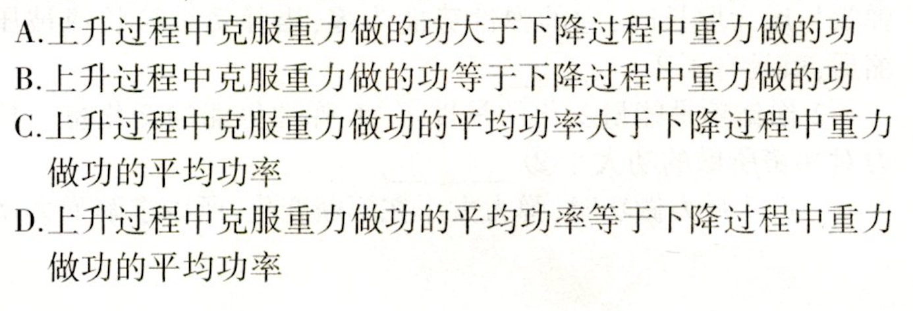

# chineseocr-onnx
chineres ocr from picture, 中英文本检测与文字识别，dense-ctc，dbnet，crnn，pse，unet等模型

# run
* set the image file path in main.py
* python main.py

# train
* text rec: https://github.com/zhangxiao339/DenseCTC-Keras
* dbnet: coming soon
* pse: todo
* unet: comming soon

# demo
* online demo: 邮箱联系获取在线demo
* data/test/demo.png

* result
    > line: 1, A.上升过程中克服重力做的功大于下降过程中重力做的功, 0.9922532439231873 
    line: 2, B.上升过程中克服重力做的功等于下降过程中重力做的功, 0.9885271787643433 
    line: 3, C.上升过程中克服重力做功的平均功率大于下降过程中重力, 0.991519570350647 
    line: 4, 做故功的平均功率, 0.9811575412750244 
    line: 5, D.上升过程中克服重力做功的平均功率等于下降过程中重力, 0.9894487261772156 
    line: 6, 做功的平均功率, 0.9874854683876038 
* total time on cpu(mac book): 1.12s
# 联系方式
* email：sinceresky@foxmail.com, 可获取支持
